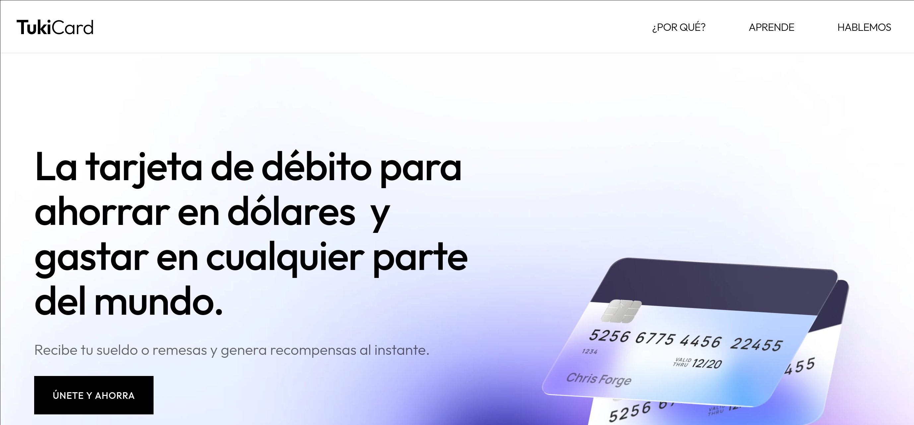
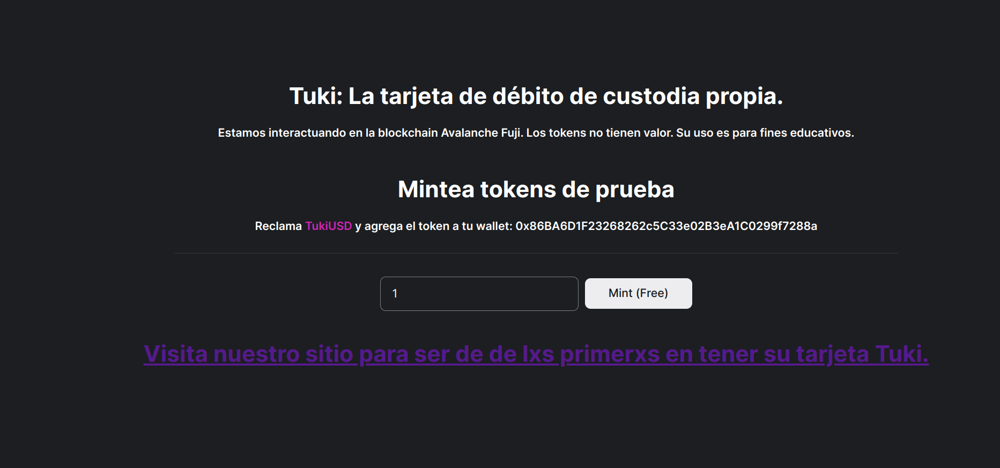

#  Tuki

     
    
     

## Token Drop en Avalanche Fuji.

### Relevant links

| What? | Link |
|---|---|
| Contract address | https://testnet.snowtrace.io/address/0x86BA6D1F23268262c5C33e02B3eA1C0299f7288a |
| Demo en Avalanche Fuji | https://avalanchestaking.vercel.app/ |
| Landing | https://tukicard.xyz |

### Tech stack
1. Next.js
2. Thirdweb.js
3. Ethers.js

### ¿Cómo funciona?
Creamos una dapp para mintear ERC-20 en la testnet Avalanche Fuji para que puedas interactuar en https://avalanchestaking.vercel.app/.

     
    
     

